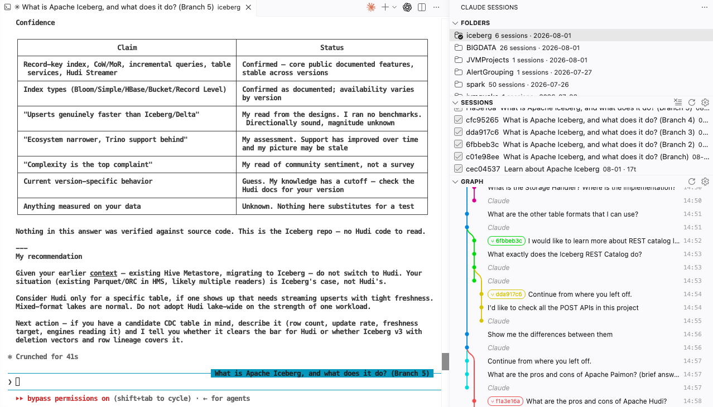
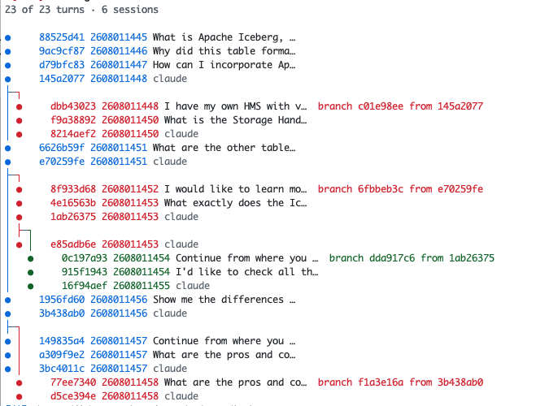

# claude-graph

For people who ask Claude Code too many questions.

You know the pattern. You ask something, the answer is 80% right, you hit Esc,
rewrite the prompt, ask again. Twenty minutes later you want the version from
*before* the rewrite. Or you branched a session to try the other approach, got
a better answer there, and now you cannot remember which of the four sessions
in your sidebar was the good one.

Claude Code kept all of it. Every rewind, every branch, every file it touched.
It just never showed you.

`claude-graph` draws that history the way Git Graph draws commits.



Six sessions there, all of them branches of one question about Iceberg, drawn
in one picture with the turn each split from.

Same thing in a terminal, if that is where you live:



The demo below is a smaller, invented one, to walk through what the marks mean:

```
11 of 11 turns · 2 sessions

●   u1 2605040901 the /pricing endpoint takes 900ms, can we cac…
●   a1 2605040902 claude
├┈┐
│ ○   u2 2605040904 just memoize it                        retry from a1
│ ●   a5 2605040904 claude
◆   u3 2605040905 add an in-process cache with a 60s TTL [1f]
◆   u4 2605040920 what happens when a tier changes mid-window [2f]
●   a3 2605040921 claude
├─┐
│ ●   b1 2605040926 what would redis cost us here instead  branch brnch000 from a3
│ ●   b3 2605040929 we are single-pod, drop it
◆   u5 2605040932 do that, and add a test for the invalidation [3f]
●   a4 2605040934 claude
```

At 09:04 you asked for memoization, thought better of it, rewound, and asked
for a TTL cache instead. That is the dotted lane. At 09:26 you split off a
whole session to price out Redis, decided against it, and it died two turns
later. That is the solid one. The diamonds are turns that wrote files, and the
last one wrote three.

## Reading it

| Mark | Means |
| --- | --- |
| `●` | a turn |
| `○` + dotted lane | **retry** — you rewound and asked again, same session |
| `⑂` + solid lane | **branch** — a whole new session split off here |
| `◆` | files were written; click it in VS Code to diff that snapshot against now |

One colour per session. Straight down a lane means the conversation just kept
going; anything sideways is a point where you changed your mind.

## Install

```bash
npx @vscode/vsce package
code --install-extension claude-graph-*.vsix
```

Then open the Claude Sessions icon in the activity bar. Three sections:

- **Folders** — every project Claude Code has ever run in. Pick one.
- **Sessions** — click one to jump to it, or tick several to compare.
- **Graph** — the picture. Sessions that never branched start collapsed.

Nothing to configure to get going: it finds your sessions on its own.

## Settings

Under `claudeSessionGraph` in VS Code settings, or the gear icon on any of the
three sections.

| Setting | Default | What it does |
| --- | --- | --- |
| `claudeHome` | `~/.claude` | Where Claude Code keeps its state. Change it if `CLAUDE_CONFIG_DIR` moved it. |
| `detail` | `user` | `user` = your prompts. `all` = every tool call too. `topology` = branch points only. |
| `showAbandoned` | off | Show rewinds you dropped after a single turn. |
| `collapseStraightSessions` | on | Sessions that never branched start collapsed. |
| `limit` | `0` | Draw only the last N turns per session. `0` draws everything. |
| `autoRefresh` | on | Redraw while a session is still running. |

## Terminal

Same graph, no VS Code. No clone, no build:

```bash
npm i -g github:pithecuse527/claude-graph
```

That puts `csg` — **c**laude **s**ession **g**raph — on your PATH. Nothing is
published to the npm registry; npm just fetches the repo and compiles it for
you. To try it once without installing anything:

```bash
npx github:pithecuse527/claude-graph --list
```

Run it from inside the project you were using Claude in — sessions are recorded
per working directory, so that is all it needs to find them.

```bash
csg --list              # what sessions exist here
csg a3f2                # draw one, by any prefix of its id
csg "pricing endpoint"  # or by a phrase from a message

csg a3f2 --dir <path>   # a project you are not currently in
```

```
--dir <path>   project working dir. default: cwd
--home <path>  Claude Code state dir. default: $CLAUDE_CONFIG_DIR or ~/.claude
--list         list sessions and exit
--all          every message, Claude's tool calls included
--topology     branch points and checkpoints only
--abandoned    also show rewinds dropped after one turn
--limit <n>    last N turns only. default: 30
--width <n>    message text width. default: 25
--ascii        ASCII-only glyphs
--no-color     no colour
```

Read-only, always. It never writes to your transcripts.

MIT.
